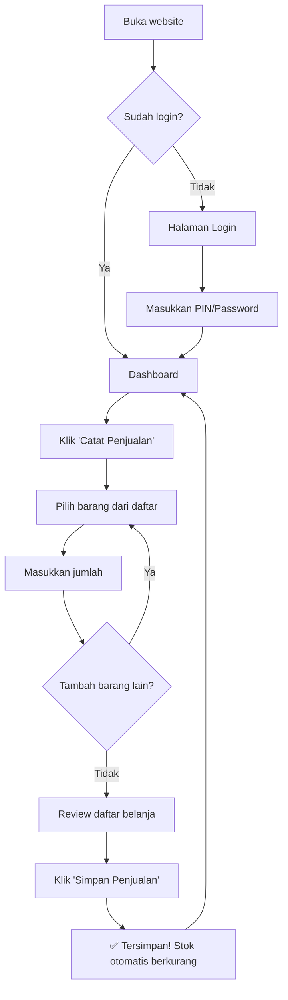
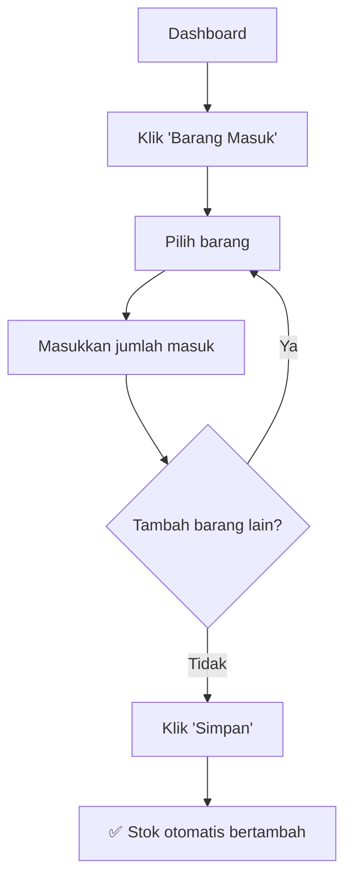
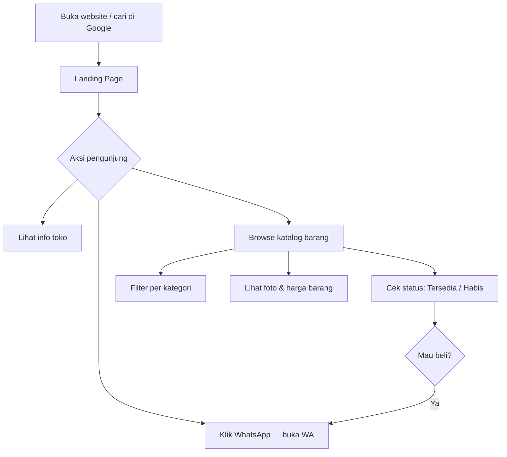
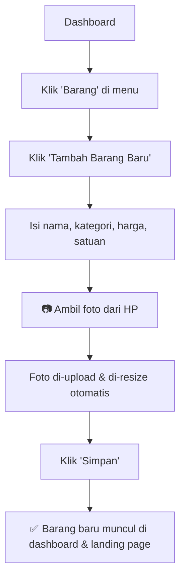
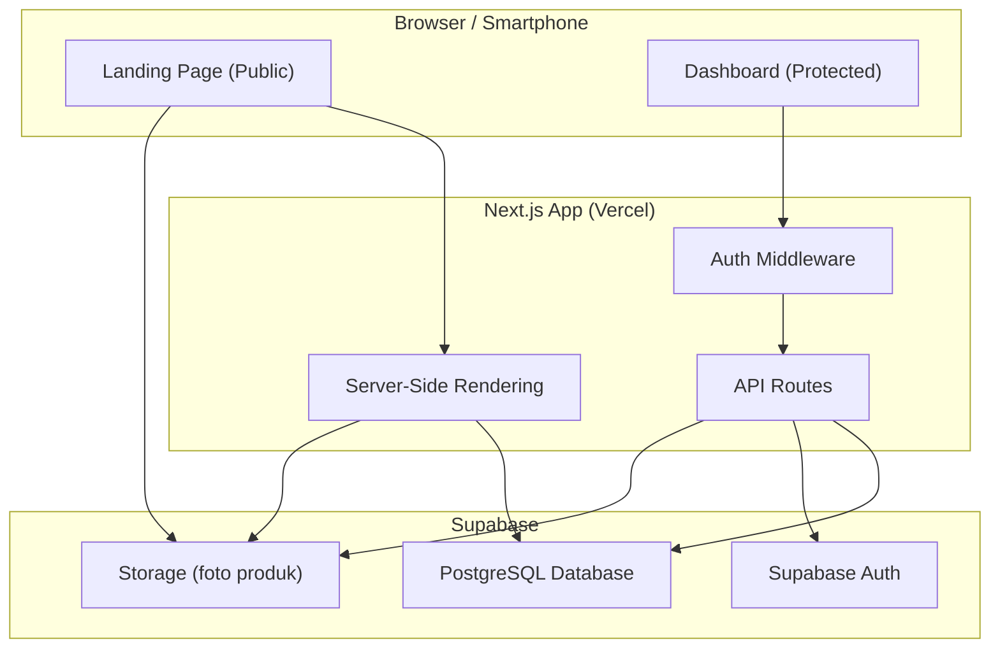
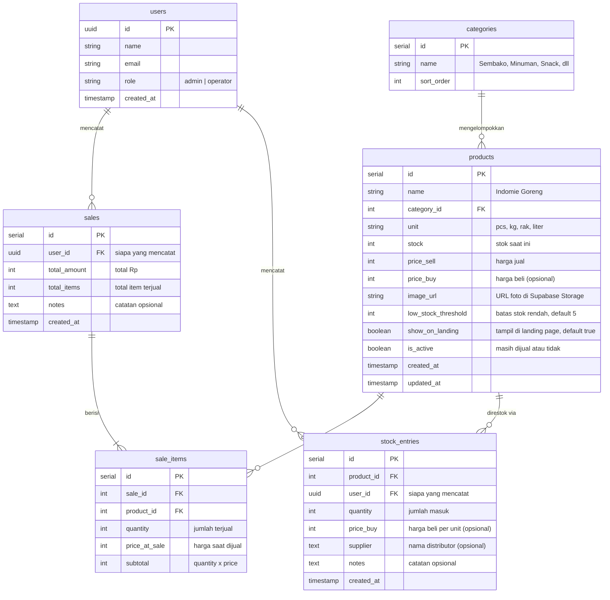

# 📋 PRD — Tokoku
### Website Profil Toko + Sistem Manajemen Stok Harian
**Versi**: 1.1  
**Tanggal**: 19 Juni 2026  
**Status**: Draft — Menunggu Review  
**Changelog**: v1.1 — Tambah katalog produk publik + foto barang di landing page

---

## 1. Overview

### Latar Belakang
Tokoku adalah toko kelontong kecil milik keluarga yang berlokasi di **Sintung, Lombok Tengah**. Toko ini melayani kebutuhan sehari-hari warga sekitar — mulai dari beras, minyak goreng, mie instan, hingga gas LPG. Saat ini pencatatan masih dilakukan secara manual (buku catatan), yang rawan hilang, robek, dan sulit ditelusuri.

### Tujuan Proyek
Membangun **satu website** yang memiliki dua fungsi utama:

| Bagian | Fungsi | Pengguna |
|--------|--------|----------|
| **Landing Page** (publik) | Profil toko, **katalog barang real-time** (dengan foto & status stok), dan kontak WhatsApp | Siapa saja |
| **Dashboard** (internal) | Manajemen stok & pencatatan penjualan harian | Mamah, Bapak, Admin |

### Problem Statement
> Pencatatan manual di buku rentan **hilang, robek, dan tidak bisa ditelusuri**. Tidak ada cara mudah untuk mengetahui stok barang secara real-time, riwayat penjualan harian, atau kapan harus belanja ke distributor.

### Success Metrics
| Metrik | Target |
|--------|--------|
| Mamah & Bapak bisa catat penjualan sendiri | ✅ Dalam minggu pertama |
| Waktu input penjualan per transaksi | < 30 detik |
| Data penjualan tersimpan & bisa ditelusuri | 100% (tidak ada yang hilang) |
| Riwayat penjualan bisa dilihat kapan saja | ✅ Per hari, mingguan, bulanan |

---

## 2. Requirements

### 2.1 User Persona

#### 👩 Mamah & 👨 Bapak (Operator Utama)
- **Usia**: 50-an tahun
- **Tech literacy**: Bisa pakai WhatsApp & smartphone dasar
- **Kebutuhan utama**: Catat penjualan harian, lihat stok, lihat riwayat
- **Pain point**: Catatan buku hilang/robek, susah cari data lama
- **Motivasi pakai sistem**: Riwayat rapi otomatis, data tidak hilang

#### 👤 Admin (Anak / Pemilik)
- **Tech literacy**: Tinggi (web developer)
- **Kebutuhan**: Full akses, kelola akun, kelola barang, backup data
- **Lokasi**: Mungkin tidak selalu di toko (remote access)

### 2.2 Functional Requirements

| ID | Requirement | Prioritas | User |
|----|-------------|-----------|------|
| FR-01 | Input penjualan harian (barang keluar) | 🔴 Critical | Mamah, Bapak |
| FR-02 | Lihat riwayat penjualan per hari | 🔴 Critical | Semua |
| FR-03 | Lihat stok barang saat ini | 🔴 Critical | Semua |
| FR-04 | Input barang masuk (dari distributor) | 🟡 High | Mamah, Admin |
| FR-05 | Tambah / edit data barang (termasuk foto) | 🟡 High | Mamah, Bapak, Admin |
| FR-05b | Hapus data barang | 🟡 High | Admin |
| FR-06 | Dashboard ringkasan harian | 🟡 High | Semua |
| FR-07 | Landing page publik dengan **katalog barang real-time** | 🔴 Critical | Publik |
| FR-07b | Tampilkan foto, harga, dan status stok (tersedia/habis) di landing page | 🔴 Critical | Publik |
| FR-08 | Prediksi barang hampir habis | 🟢 Medium | Semua |
| FR-09 | Saran belanja distributor | 🔵 Low | Admin |
| FR-10 | Sistem login & hak akses | 🟡 High | Semua |
| FR-11 | Upload foto barang dari HP | 🟡 High | Mamah, Bapak, Admin |

### 2.3 Non-Functional Requirements

| Requirement | Detail |
|-------------|--------|
| **Usability** | UI harus super simpel — tombol besar, teks jelas, warna kontras tinggi. Harus bisa dipakai orang tua tanpa pelatihan khusus |
| **Performance** | Halaman load < 3 detik pada koneksi 3G |
| **Reliability** | Data tersimpan di cloud, tidak hilang meskipun HP rusak |
| **Accessibility** | Font minimum 16px, touch target minimum 44px, bahasa Indonesia |
| **Security** | Login dengan PIN/password sederhana, session persistent |
| **Responsiveness** | Mobile-first (mayoritas akses via smartphone) |

### 2.4 Hal yang TIDAK Termasuk (Out of Scope v1)

> [!IMPORTANT]
> Fitur-fitur berikut **sengaja tidak dimasukkan** untuk menjaga kesederhanaan:

- ❌ Barcode scanner
- ❌ POS (Point of Sale) rumit
- ❌ Grafik & chart kompleks
- ❌ Sistem checkout / e-commerce online
- ❌ Membership & loyalty point pelanggan
- ❌ Promo, voucher, diskon
- ❌ Multi-toko
- ❌ Integrasi pembayaran digital
- ❌ Notifikasi push

---

## 3. Core Features

### 3.1 🛒 Input Penjualan (Prioritas #1)

Fitur paling utama. Ini yang pertama kali harus bisa dilakukan begitu login.

**Cara kerja:**
1. Mamah/Bapak buka halaman "Penjualan"
2. Pilih barang dari daftar (ketik untuk search / scroll)
3. Masukkan jumlah
4. Bisa tambah beberapa barang sekaligus (seperti keranjang)
5. Klik **"Simpan Penjualan"**
6. Stok otomatis berkurang
7. Tercatat di riwayat dengan tanggal & waktu

**Contoh:**
```
Penjualan — 19 Juni 2026, 14:30

  Indomie Goreng     x3     Rp  9.000
  Bimoli 1L          x1     Rp 18.000
  Kopi Kapal Api     x2     Rp  5.000
                            ─────────
  Total                     Rp 32.000

  [Simpan Penjualan]
```

### 3.2 📋 Riwayat Penjualan (Prioritas #2)

**Tampilan:**
- Daftar penjualan per hari
- Bisa lihat detail setiap transaksi
- Total penjualan per hari

```
Riwayat Penjualan

  📅 19 Juni 2026    Rp 1.250.000    65 item    ▶
  📅 18 Juni 2026    Rp   850.000    42 item    ▶
  📅 17 Juni 2026    Rp 1.200.000    58 item    ▶
```

Klik salah satu hari → muncul detail semua transaksi hari itu.

### 3.3 📦 Stok Barang

**Tampilan:**
- Daftar semua barang + stok saat ini
- Barang dengan stok rendah ditandai warna merah/kuning
- Search/filter barang

```
Daftar Barang

  🔴  Beras 5kg         3      (hampir habis!)
  🟡  Minyak Bimoli     8
  🟢  Indomie Goreng    50
  🟢  Telur (rak)       12
  🟢  Gas LPG 3kg       6
```

### 3.4 📥 Barang Masuk (Restok)

Saat beli dari distributor/supplier:

1. Pilih barang
2. Masukkan jumlah yang masuk
3. (Opsional) Masukkan harga beli
4. Klik **"Simpan"**
5. Stok otomatis bertambah

```
Barang Masuk — 19 Juni 2026

  Indomie Goreng     +100
  Bimoli 1L          +20
  Telur              +15 rak

  [Simpan Barang Masuk]
```

### 3.5 📊 Dashboard Ringkasan

Halaman pertama setelah login. Menampilkan info penting hari ini:

```
Selamat Siang, Mamah! 👋

  💰 Penjualan Hari Ini     Rp 1.250.000
  📦 Barang Terjual          65 item
  ⚠️  Stok Hampir Habis       5 barang

  [Catat Penjualan]   ← tombol besar, paling menonjol
```

### 3.6 🔮 Prediksi Stok (Sederhana)

Bukan AI canggih — hanya kalkulasi rata-rata penjualan per hari:

```
⚠️ Perlu Restok Segera

  Indomie:   rata-rata 10/hari  |  stok 25  |  ~2 hari lagi
  Bimoli:    rata-rata 3/hari   |  stok 5   |  ~1 hari lagi
  Beras 5kg: rata-rata 2/hari   |  stok 3   |  ~1 hari lagi
```

**Logika:**
```
estimasi_hari_habis = stok_sekarang / rata_rata_penjualan_7_hari_terakhir
```

### 3.7 🌐 Landing Page (Publik)

Halaman **dinamis** yang bisa diakses siapa saja tanpa login. Data barang diambil langsung dari database sehingga selalu up-to-date.

**Bagian 1 — Hero & Info Toko:**
```
┌─────────────────────────────────────┐
│                                     │
│     🏪 Toko Berkah Sintung          │
│                                     │
│  Melayani kebutuhan sehari-hari     │
│  warga Sintung dan sekitarnya       │
│                                     │
│  📍 Sintung, Lombok Tengah          │
│  🕐 Buka: 06.00 - 22.00            │
│                                     │
│  [💬 Hubungi via WhatsApp]          │
│                                     │
└─────────────────────────────────────┘
```

**Bagian 2 — Katalog Barang (Real-time dari Database):**

Menampilkan semua barang yang `is_active = true`, dikelompokkan per kategori, lengkap dengan **foto**, **harga**, dan **status ketersediaan**.

```
┌─────────────────────────────────────┐
│  📦 Produk Kami                     │
│                                     │
│  [Semua] [Sembako] [Minuman] [Snack]│  ← filter kategori
│                                     │
│  ┌──────────┐  ┌──────────┐         │
│  │ 📷 foto  │  │ 📷 foto  │         │
│  │ Beras 5kg│  │ Indomie  │         │
│  │ Rp25.000 │  │ Rp3.000  │         │
│  │ ✅ Ada   │  │ ✅ Ada   │         │
│  └──────────┘  └──────────┘         │
│                                     │
│  ┌──────────┐  ┌──────────┐         │
│  │ 📷 foto  │  │ 📷 foto  │         │
│  │ Minyak   │  │ Gula 1kg │         │
│  │ Rp18.000 │  │ Rp15.000 │         │
│  │ ✅ Ada   │  │ 🔴 Habis │         │
│  └──────────┘  └──────────┘         │
│                                     │
└─────────────────────────────────────┘
```

**Logika status stok di landing page:**
```
Jika stock > low_stock_threshold  → ✅ Tersedia
Jika stock > 0 tapi <= threshold  → 🟡 Stok Terbatas
Jika stock == 0                   → 🔴 Habis
```

> [!NOTE]
> Landing page **tidak** menampilkan jumlah stok pasti (angka) ke publik — hanya status ketersediaan. Ini untuk menghindari informasi sensitif terekspos.

**Bagian 3 — Footer & Kontak:**
```
┌─────────────────────────────────────┐
│  📍 Lokasi: Sintung, Lombok Tengah  │
│  🕐 Jam Buka: 06.00 - 22.00        │
│  📞 WhatsApp: 08xx-xxxx-xxxx       │
│                                     │
│  [💬 Pesan via WhatsApp]            │
└─────────────────────────────────────┘
```

### 3.8 📸 Upload Foto Barang

Mamah, Bapak, atau Admin bisa menambahkan foto barang langsung dari HP:

1. Buka halaman "Barang" di dashboard
2. Klik barang yang ingin ditambah foto, atau saat tambah barang baru
3. Klik tombol **"📷 Tambah Foto"**
4. Pilih foto dari galeri HP atau ambil foto langsung dari kamera
5. Foto otomatis di-resize & di-upload ke Supabase Storage
6. Foto langsung tampil di landing page publik

**Spesifikasi foto:**
- Format: JPG / PNG / WebP
- Ukuran maksimal: 2MB (auto-compress jika lebih besar)
- Resolusi: Auto-resize ke 400x400px (untuk loading cepat)
- Jika tidak ada foto: tampilkan placeholder icon sesuai kategori

---

## 4. User Flow

### 4.1 Flow Utama — Catat Penjualan (Daily Use)



### 4.2 Flow Barang Masuk (Restok)



### 4.3 Flow Landing Page (Pengunjung)



### 4.4 Flow Tambah Barang Baru (Mamah/Bapak)



---

## 5. Architecture

### 5.1 Arsitektur Tingkat Tinggi



### 5.2 Struktur Halaman

```
/                       → Landing Page (publik)
/login                  → Halaman Login
/dashboard              → Dashboard Ringkasan (protected)
/dashboard/penjualan    → Input Penjualan (protected)
/dashboard/barang       → Daftar & Kelola Barang (protected)
/dashboard/barang-masuk → Input Barang Masuk (protected)
/dashboard/riwayat      → Riwayat Penjualan (protected)
/dashboard/pengaturan   → Pengaturan & Kelola Akun (admin only)
```

### 5.3 Hak Akses

| Halaman / Fitur | 👤 Admin | 👩 Operator (Mamah/Bapak) |
|-----------------|----------|---------------------------|
| Dashboard | ✅ | ✅ |
| Input Penjualan | ✅ | ✅ |
| Riwayat Penjualan | ✅ | ✅ |
| Lihat Stok | ✅ | ✅ |
| Barang Masuk (Restok) | ✅ | ✅ |
| **Tambah Barang Baru** | ✅ | ✅ |
| **Edit Barang & Upload Foto** | ✅ | ✅ |
| Hapus Barang | ✅ | ❌ |
| Kelola Akun | ✅ | ❌ |
| Pengaturan Sistem | ✅ | ❌ |

---

## 6. Database Schema

### 6.1 Entity Relationship Diagram



### 6.2 Detail Tabel

#### `users`
Menyimpan data pengguna yang bisa login ke dashboard.

| Kolom | Tipe | Keterangan |
|-------|------|------------|
| id | UUID (PK) | ID dari Supabase Auth |
| name | VARCHAR(100) | Nama tampilan ("Mamah", "Bapak") |
| email | VARCHAR(255) | Email untuk login |
| role | ENUM | `admin` atau `operator` |
| created_at | TIMESTAMP | Waktu dibuat |

#### `products`
Daftar semua barang yang dijual di toko.

| Kolom | Tipe | Keterangan |
|-------|------|------------|
| id | SERIAL (PK) | Auto-increment |
| name | VARCHAR(200) | Nama barang |
| category_id | INT (FK) | Kategori barang |
| unit | VARCHAR(20) | Satuan: pcs, kg, rak, liter |
| stock | INT | Stok saat ini (auto-update) |
| price_sell | INT | Harga jual (Rupiah) |
| price_buy | INT | Harga beli, opsional |
| **image_url** | VARCHAR(500) | URL foto produk di Supabase Storage (nullable) |
| low_stock_threshold | INT | Default 5, untuk alert stok rendah |
| **show_on_landing** | BOOLEAN | Default true — apakah tampil di landing page publik |
| is_active | BOOLEAN | Default true |
| created_at | TIMESTAMP | - |
| updated_at | TIMESTAMP | - |

#### `sales`
Satu record = satu transaksi penjualan (bisa berisi banyak item).

| Kolom | Tipe | Keterangan |
|-------|------|------------|
| id | SERIAL (PK) | Auto-increment |
| user_id | UUID (FK) | Siapa yang mencatat |
| total_amount | INT | Total Rupiah |
| total_items | INT | Total item terjual |
| notes | TEXT | Catatan opsional |
| created_at | TIMESTAMP | Waktu transaksi |

#### `sale_items`
Detail item dalam satu transaksi penjualan.

| Kolom | Tipe | Keterangan |
|-------|------|------------|
| id | SERIAL (PK) | Auto-increment |
| sale_id | INT (FK) | Referensi ke sales |
| product_id | INT (FK) | Barang yang dijual |
| quantity | INT | Jumlah |
| price_at_sale | INT | Harga jual saat itu |
| subtotal | INT | quantity × price |

#### `stock_entries`
Catatan barang masuk (dari distributor/supplier).

| Kolom | Tipe | Keterangan |
|-------|------|------------|
| id | SERIAL (PK) | Auto-increment |
| product_id | INT (FK) | Barang yang direstok |
| user_id | UUID (FK) | Siapa yang mencatat |
| quantity | INT | Jumlah masuk |
| price_buy | INT | Harga beli per unit (opsional) |
| supplier | VARCHAR(200) | Nama distributor (opsional) |
| notes | TEXT | Catatan opsional |
| created_at | TIMESTAMP | Waktu restok |

### 6.3 Auto-Update Stok

Stok di tabel `products` di-update otomatis melalui database trigger atau logic di API:

```
Saat Penjualan:    products.stock -= sale_items.quantity
Saat Barang Masuk: products.stock += stock_entries.quantity
```

---

## 7. Tech Stack

### 7.1 Stack yang Dipilih

| Layer | Teknologi | Alasan |
|-------|-----------|--------|
| **Framework** | Next.js 14+ (App Router) | Full-stack, SSR untuk landing page SEO, API routes built-in |
| **Bahasa** | TypeScript | Type safety, autocomplete, mencegah bug |
| **Styling** | Vanilla CSS | Kontrol penuh, tanpa dependency tambahan |
| **Database** | Supabase (PostgreSQL) | Gratis tier, auth built-in, realtime, hosted |
| **Auth** | Supabase Auth | Simple email/password, session management |
| **File Storage** | Supabase Storage | Menyimpan foto produk, gratis 1GB |
| **Hosting** | Vercel | Gratis, auto-deploy dari Git, edge network |
| **Font** | Google Fonts (Inter) | Modern, clean, mudah dibaca |

### 7.2 Estimasi Biaya

| Item | Biaya |
|------|-------|
| Supabase (free tier) | **Rp 0** |
| Vercel (free tier) | **Rp 0** |
| Domain (.com) | **~Rp 150.000/tahun** |
| **Total** | **~Rp 150.000/tahun** |

> [!TIP]
> Bisa juga tanpa beli domain dulu — pakai subdomain gratis dari Vercel (`tokoku.vercel.app`) untuk testing awal.

### 7.3 Struktur Project

```
tokoku/
├── public/
│   └── images/              # Foto toko, logo
├── src/
│   ├── app/
│   │   ├── page.tsx                    # Landing Page
│   │   ├── login/page.tsx              # Login
│   │   ├── layout.tsx                  # Root Layout
│   │   └── dashboard/
│   │       ├── page.tsx                # Dashboard Ringkasan
│   │       ├── layout.tsx              # Dashboard Layout (sidebar)
│   │       ├── penjualan/page.tsx      # Input Penjualan
│   │       ├── barang/page.tsx         # Daftar Barang
│   │       ├── barang-masuk/page.tsx   # Input Barang Masuk
│   │       ├── riwayat/page.tsx        # Riwayat Penjualan
│   │       └── pengaturan/page.tsx     # Pengaturan (admin)
│   ├── components/
│   │   ├── ui/                  # Tombol, Input, Card, Modal
│   │   ├── landing/             # Komponen Landing Page
│   │   └── dashboard/           # Komponen Dashboard
│   ├── lib/
│   │   ├── supabase.ts          # Supabase client
│   │   ├── auth.ts              # Auth helpers
│   │   └── utils.ts             # Utility functions
│   ├── hooks/                   # Custom React hooks
│   └── styles/
│       └── globals.css          # Global styles + design tokens
├── supabase/
│   └── migrations/              # SQL migrations
├── next.config.js
├── package.json
└── tsconfig.json
```

---

## Appendix: Prioritas Pengembangan

### 🏁 Phase 1 — MVP (Minggu 1-2)
> Yang harus ada agar mamah & bapak bisa mulai pakai

- [  ] Setup project Next.js + Supabase
- [  ] Database schema & migrations
- [  ] Sistem login (email + password)
- [  ] Input Penjualan ← **fitur utama**
- [  ] Riwayat Penjualan per hari
- [  ] Daftar Barang + Stok
- [  ] Seed data barang-barang toko

### 🚀 Phase 2 — Lengkapi (Minggu 3-4)
> Fitur pendukung yang bikin lebih nyaman

- [  ] Dashboard ringkasan harian
- [  ] Barang masuk (restok)
- [  ] Tambah / edit / hapus barang **(mamah & bapak bisa tambah & edit)**
- [  ] **Upload foto barang dari HP** (Supabase Storage)
- [  ] Alert stok hampir habis
- [  ] Hak akses (admin vs operator)

### 🌐 Phase 3 — Landing Page & Polish (Minggu 5)
> Pelengkap agar toko bisa ditemukan online

- [  ] Landing page publik dengan **katalog barang real-time**
- [  ] Tampilkan foto, harga, dan status stok (tersedia/terbatas/habis)
- [  ] Filter barang per kategori
- [  ] SEO (meta tags, Open Graph)
- [  ] Tombol WhatsApp
- [  ] Prediksi stok habis (sederhana)
- [  ] Saran belanja distributor
- [  ] Deploy ke Vercel + setup domain

---

> [!NOTE]
> Dokumen ini adalah **draft awal**. Silakan review dan berikan feedback sebelum masuk ke tahap implementasi.
